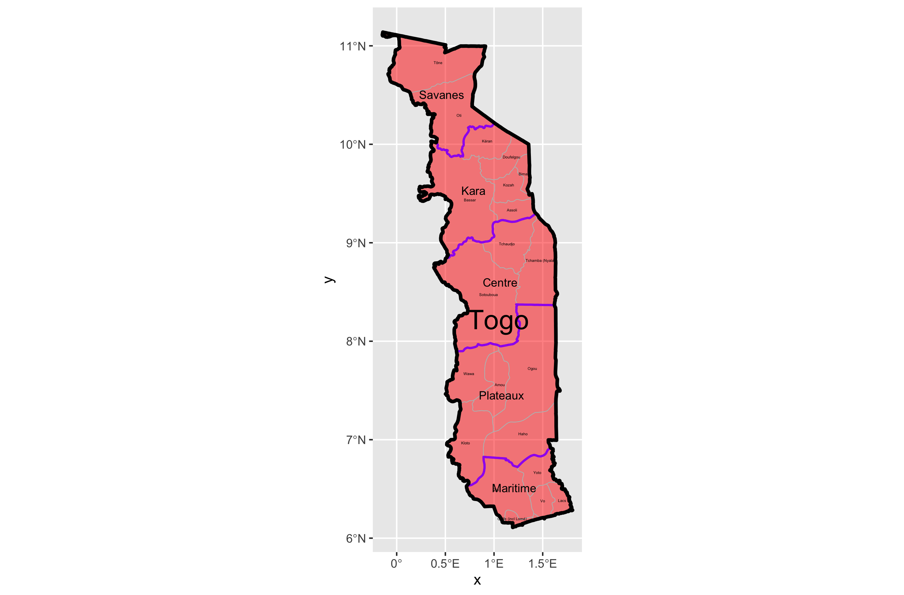

# Final Project

Jimmy Halderman

## Political Districts and Prefectures of Togo

Togo is divided into 5 administrative regions and 35 prefectures.A Relatively small West African country, Togo holds a total population slightly below 8 million and encompasses a geographic area of about 22,000 square miles. 

The southernmost Region, Maritime, has the highest population and population density of the 5 regions. The region borders the Gulf of Guinea and also hosts the capital city of Lome. The further away from the capital and shoreline a region is, the less dense its population.

Kara County is one of the more rural and sparsley populated regions of the country. 

------

The plot below shows the topographic contours of togo, one of the key covariates that can be used to predict population density. Variables like landcover, nightime lights, slope(of the land) are all examples of covariates that can be used to creat highly succesful models and predicitions of population. Often, Data scientists will create multiple predictions and then compare the error, often referred to in statistics as r squared, to see which model has the most succesful prediction. By doing this, data scientists can zero in on the best way to accuratley map populations and which variables are most important.  

The chain of mountains and hills throughout the middle of the country are the eponymously named, Togo Mountains. Extending into Ghana on the Western border and Benin on the Eastern. The mountains cut off the most rural region of Savanes from the lower regions of the Country. The difficult topographic features of Togo may contribute to its difficulty in developing infrastructure into the northern regions. International development experts and organizations have advocated that in increase in rural development, specifically in roads would be one of the most effective way to help develop the country. 
https://constructionreviewonline.com/2019/09/togo-to-receive-us-33-7m-for-road-project-in-togo/

Here is an example of nightime lights throughout Togo.

------

