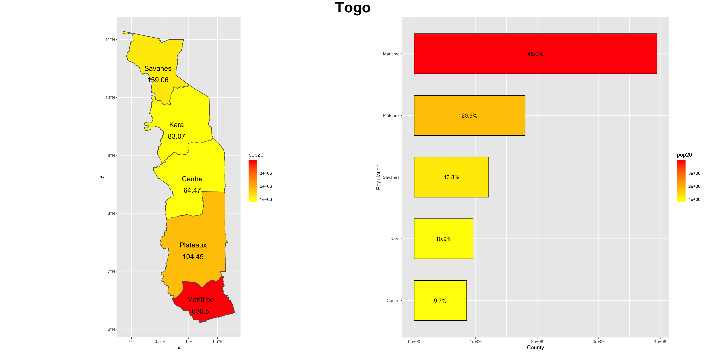

# Final Project

Jimmy Halderman

## Political Districts and Prefectures of Togo

Togo is divided into 5 administrative regions and 35 prefectures. A Relatively small West African country, Togo holds a total population slightly below 8 million and encompasses a geographic area of about 22,000 square miles. 

The southernmost Region, Maritime, has the highest population and population density of the 5 regions. The region borders the Gulf of Guinea and also hosts the capital city of Lome. The further away from the capital and shoreline a region is, the less dense its population.

------

The plot below shows the topographic contours of togo, one of the key covariates that can be used to predict population density. Variables like landcover, nightime lights, slope(of the land) are all examples of covariates that can be used to create highly succesful models and predicitions of populations. Often, Data scientists will create multiple predictions and then compare the error, often referred to in statistics as r squared, to see which model has the most succesful prediction. By doing this, data scientists can zero in on the best way to accuratley map populations and which variables are most important.  

The chain of mountains and hills throughout the middle of the country are the eponymously named, Togo Mountains. Extending into Ghana on the Western border and Benin on the Eastern. The mountains cut off the most rural region of Savanes from the lower regions of the Country. The difficult topographic features of Togo may contribute to its difficulty in developing infrastructure into the northern regions. International development experts and organizations have advocated that in increase in rural development, specifically in roads would be one of the most effective way to help develop the country. 
https://constructionreviewonline.com/2019/09/togo-to-receive-us-33-7m-for-road-project-in-togo/

Using variables like Nightime lights, allow for data scientists to create "bottom up" type models that can be replicated and used in other areas. For example, a "top down" approach of mapping population, which focuses on national census data or government stastics and surveys can not be applied to a country where those surveys have not taken place. They also leave wide gaps in our understanding of what factors might change overtime, like rising sea levels, deterioration of infrastructure of migration. A bottom up approach, which can be falsified and corrected in a controled test against national survey data that is accurate, can then be repeated, applied and edited to create a scalable population mapping solution. Using covariates like nightime lights or topography, means that through simple big data collections like satelite imagery or cellphone metadata, data scientists have the power to use the already abundant ammount of data infront of them to create better models. 

Here is an example of nightime lights throughout Togo. 

------

Kara county, located in the north and seperated by the Togo Mountains, is the second most rural region of the country. 

The Bimah Prefecture of Kara county is an interesting district. While located in the rural Kara county. It lies next to the international border of Benin, specifically the Donga region of Benin. Donga holds a the fourth largest city of Benin and has much more highways/roads than the bordering Bimah. These 2 regions present themselves as an interesting case study for the potential differences that highway and road development can play in the urbanization and population growth of a city. As well as how populations can vary widely across small areas, if they are divided by political boundaries like an international border. 
Below, the population density and urban areas of Bimah are shown. 

