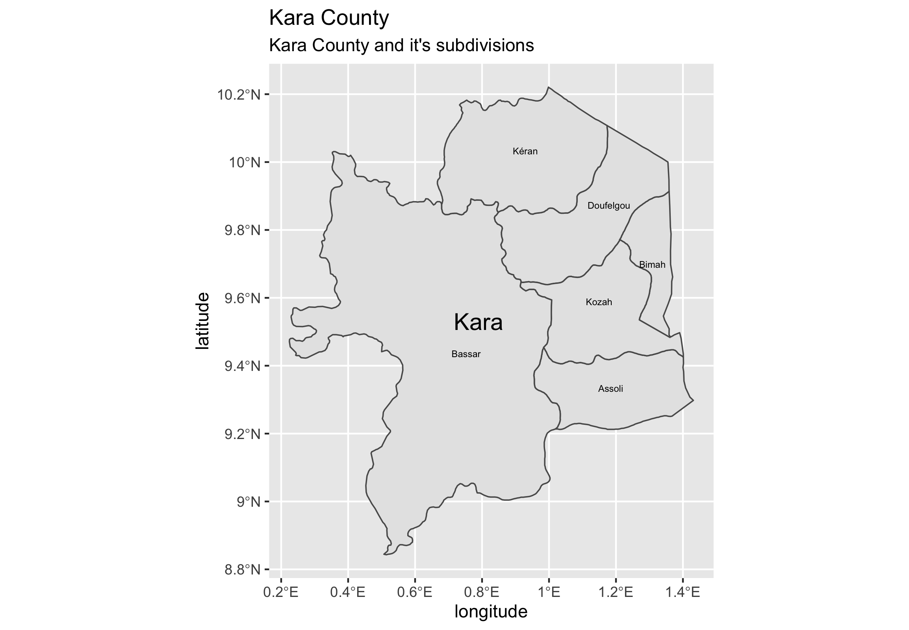

### Project 1

# Initial administrative border explorations with ADM1 and ADM2

Different administrative border outlines were aggregated onto the national outlines. Names were added and assigned to their corresponding district.

# Administrative Subdivision Stretch Goal (Kara County)

Kara County was separated from the original and expanded into a separate image.

# Initial population bar graph

Population was disaggregated onto administrative borders and converted to percentages

# Togo side by side comparison 

Population was converted to both total counts and percentages, presented side by side with a bar graph of administrative district and a map showing the same population data.

I thoroughly enjoyed my first project exploring R. In this project, I wanted to expand on some of my previous research on Western Africa. After realizing that the large file sizes of Nigeria would be difficult to manage, I decided to use the nearby (and much smaller country Togo instead. The small size and heavily concentrated population of Togo proved to be an enjoyable and interesting country to geographically analyze. Most of my challenges came from misunderstanding which variables to identify, and then recall later. When dealing with similar data sets, modify them, stratifying them and assigning them, using a logical nomenclature became a necessity and a very useful improvement to my once jumbled and nonsensical names. 

